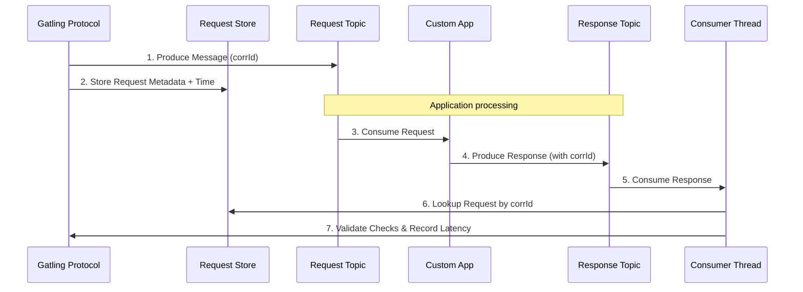

# Architecture & Core Concepts

To use the Gatling Kafka Extension effectively, especially when tuning performance, it helps to understand its underlying architecture.

## The Request-Reply Flow

The core of the extension is measuring the end-to-end latency of a system via the **Request-Reply** pattern.

### Flow Breakdown:
1. **Send**: Gatling generates a unique correlation ID and sends the request message to the `request_topic`.
2. **Store**: Gatling stores the request details (key, payload, timestamp) in a **Request Store**.
3. **Application**: Your Application consumes the request, processes it, and generates a response.
4. **Respond**: The application MUST include the same correlation ID when sending the response to the `response_topic`.
5. **Receive**: The Gatling Kafka Consumer reads the response.
6. **Match**: The consumer looks up the original request in the Request Store using the correlation ID.
7. **Verify**: If found, Gatling runs your **Message Checks** to validate the response and records the end-to-end transaction time.

---

## Core Components

### The Protocol (`KafkaProtocol`)
This defines the configuration shared across all users in the simulation. It holds connection details (bootstrap servers), serialization logic, and connection pools for internal stores.

> **Note**: A single `KafkaProtocol` instance is designed to handle a single discrete topic configuration. If your test interacts with multiple different payload types (e.g., JSON on one topic, Avro on another), you configure [Multiple Protocols](multi-protocol.md).

### The Request Store (`RequestStore`)
Because testing asynchronous distributed systems is complex, Gatling cannot simply block a thread waiting for a response. Furthermore, responses might arrive out of order, or even *before* the request is fully tracked. 

The `RequestStore` safely bridges the Producer and Consumer threads.

- **InMemoryRequestStore** (Default): Stores requests in an internal `ConcurrentHashMap`. Extremely fast but data is lost if Gatling terminates. Ideal for standard development and CI testing.
- **RedisRequestStore** (Enterprise): High-performance distributed tracking, ideal for horizontally scaled Gatling clusters.
- **PostgresRequestStore** (Enterprise): Backed by PostgreSQL. Heavily recommended for Chaos Engineering, as requests safely survive Gatling application reboots or long-spanning failure scenarios.

### Producers & Consumers
Unlike Gatling HTTP which spins up concurrent connections per user, Kafka uses heavy-weight Thread-safe clients.

* **Producer**: Thread-safe and incredibly high throughput. By default, the extension uses just `1` producer instance. You rarely need to increase this unless you notice thread contention, as one Kafka producer can saturate most network interfaces.
* **Consumer**: The extension spins up dedicated **Consumer Threads**. The number of threads (`numConsumers(int)`) should typically match the number of **partitions** of the response topic. Having more consumers than partitions results in idle threads.
