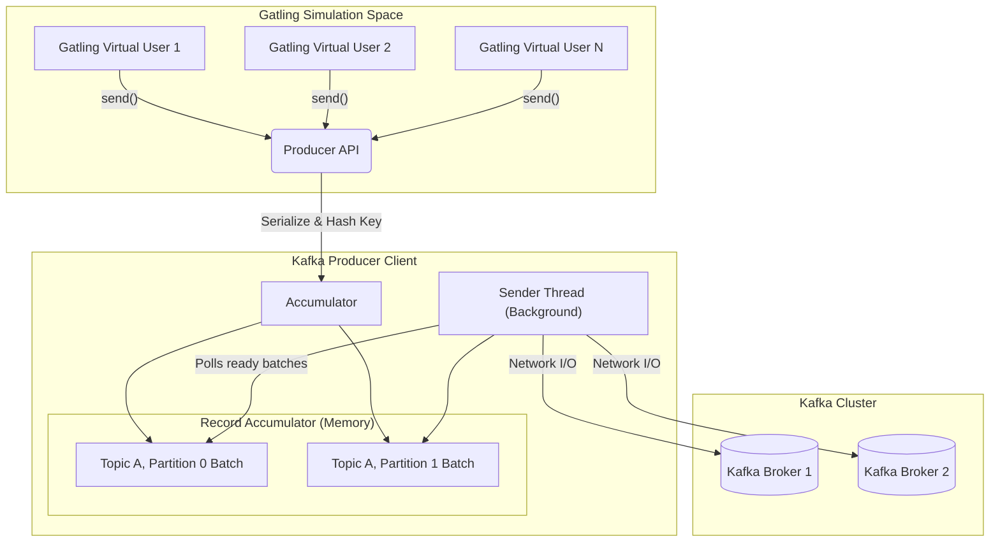
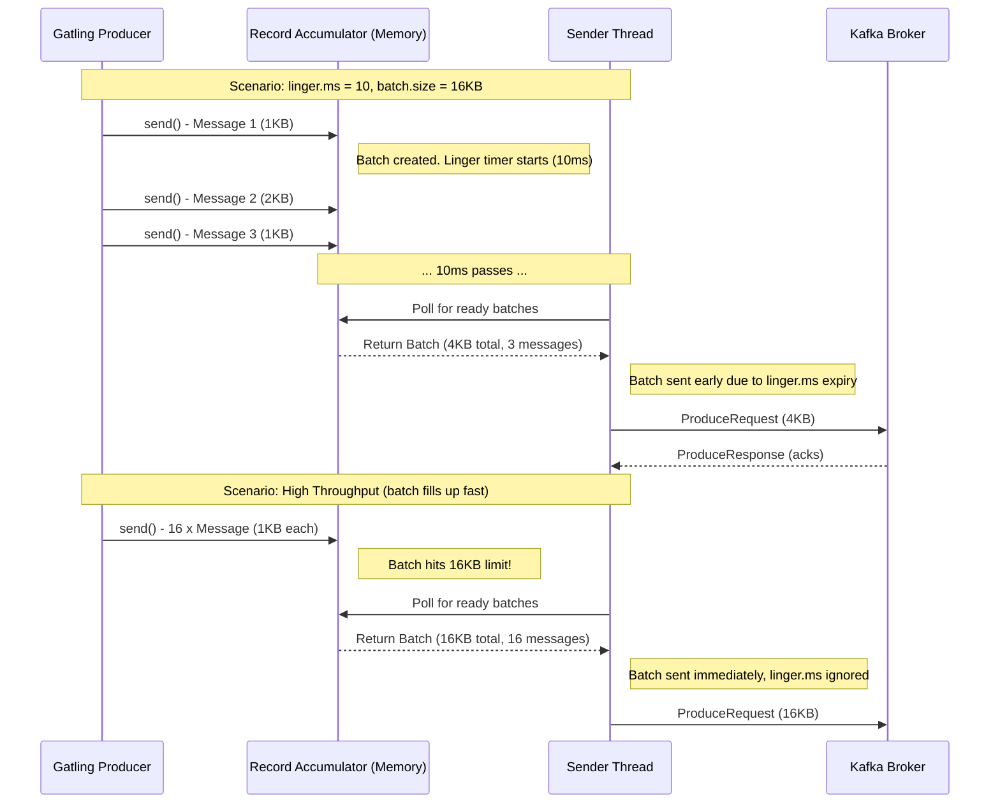
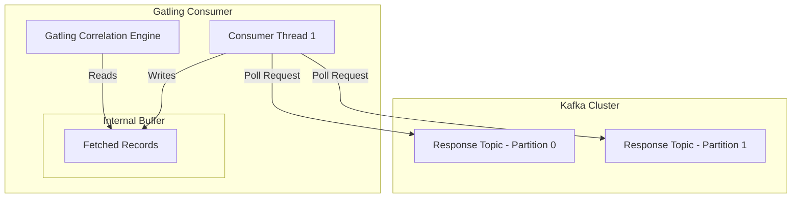
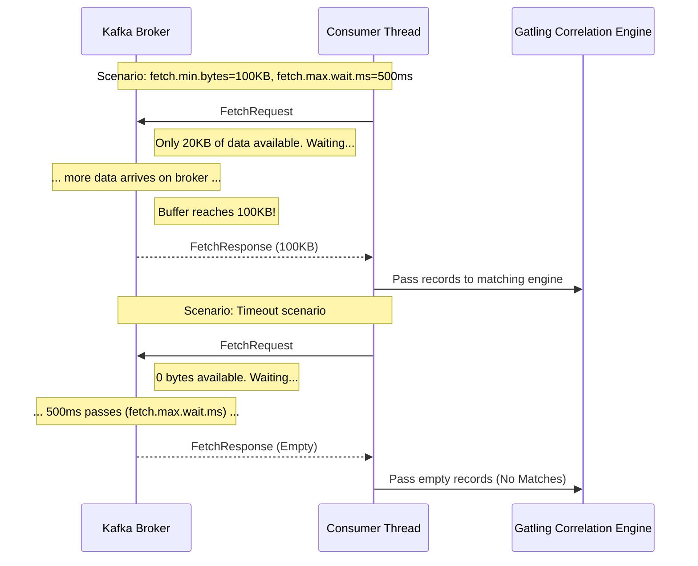

# Kafka 101: Architecture & Performance

To load test Apache Kafka effectively with Gatling, it is crucial to understand the underlying architecture of Kafka Producers and Consumers. Unlike HTTP, which is a simple request-reply protocol over a socket, Kafka uses asynchronous, heavily batched, and thread-driven clients.

This guide explains the core architecture and how specific configuration parameters directly impact **throughput** (messages per second) and **latency** (time taken to send/receive).

---

## 1. Producer Architecture

The Gatling Kafka Extension's `kafka("...").send()` action does not write data directly to the network. Instead, it hands the payload over to the internal Apache Kafka Producer.

### How the Producer Works
1. **Serialization**: Gatling converts your payload into bytes using the configured Serializer (e.g., String, Avro).
2. **Partitioning**: If a `key` is provided, Kafka hashes it to determine which partition the message belongs to.
3. **Accumulation**: The message is added to a memory buffer (`RecordAccumulator`) specific to that partition.
4. **Sending**: A background "Sender Thread" continuously wakes up, takes full batches from the accumulator, compresses them, and sends them over the network to the brokers.

### Key Producer Parameters

Tuning the producer revolves around balancing the batch size (which improves throughput) against the linger time (which affects latency).

#### `linger.ms` (Default: 0)
* **What it does**: "Artificial delay". How long the Sender Thread should wait for more messages to arrive before sending a partially full batch.
* **Impact**:
  * **Increase** (e.g., `5` or `10`): Greatly increases **Throughput**. Batches fill up more, resulting in fewer network requests, better compression ratios, and lower broker CPU usage.
  * **Decrease** (`0`): Best for minimum **Latency**. The thread sends data immediately, but causes massive network/broker overhead at high message rates.

#### `batch.size` (Default: 16384 bytes / 16KB)
* **What it does**: The maximum size of a single batch in memory. When a batch hits this limit, it is sent immediately regardless of `linger.ms`.
* **Impact**:
  * **Increase** (e.g., `131072` / 128KB): Improves **Throughput** for high-volume tests, assuming you also have a non-zero `linger.ms`.
  * **Decrease**: Rarely useful unless memory is severely constrained.

#### `acks` (Default: "all" / -1 in newer clients, "1" in older)
* **What it does**: The level of durability guarantee required from the broker before the producer considers the send successful.
* **Impact**:
  * **`acks=all`**: Highest **Latency**. The leader broker waits for all in-sync replicas to confirm they wrote the data. Required for exact-once semantics.
  * **`acks=1`**: Lower **Latency**. Only the leader acknowledges. Slight risk of data loss.
  * **`acks=0`**: Lowest **Latency** / Highest **Throughput**. "Fire and forget." The producer doesn't wait for any response from the broker.

#### `compression.type` (Default: "none")
* **What it does**: Compresses full batches before sending them over the network.
* **Impact**:
  * `lz4` or `snappy`: Highly recommended. Massively increases **Throughput** by reducing network bottleneck, with very low CPU overhead.
  * `zstd`: Best compression ratio (lowest network usage), but higher CPU cost on both client and broker.

---

## 2. Consumer Architecture

In Gatling Request-Reply tests, a background Consumer Thread constantly polls the response topic to find replies and match them to pending Gatling requests.

### How the Consumer Works
1. **Polling**: The Consumer thread calls `poll()`, sending a Fetch Request to the broker.
2. **Buffering**: The broker returns a chunk of records. The consumer places them in an internal buffer.
3. **Processing**: Gatling iterates through the buffer, extracting correlation IDs (keys/headers) and completing the pending Gatling virtual user sessions.

### Key Consumer Parameters

Understanding the relationship between Gatling's internal polling loop and Kafka's fetch requests is crucial for accurately interpreting latency.

#### `numConsumers` (Gatling DSL Setting)
* **What it does**: Sets the number of background Consumer Threads Gatling spins up.
* **Impact**: 
  * You should set this **equal to the number of partitions** on your response topic (e.g., if `response-topic` has 4 partitions, use `.numConsumers(4)`).
  * **Too High**: Wasteful. Threads will sit entirely idle because Kafka only allows one consumer per partition within a consumer group.
  * **Too Low**: Reduces **Throughput** and spikes **Latency**. A single thread will have to sequentially process data from multiple partitions.

#### `fetch.min.bytes` (Default: 1)
* **What it does**: The minimum amount of data the broker should gather before answering the consumer's Fetch Request.
* **Impact**:
  * **Increase** (e.g., `100000` / 100KB): Increases **Throughput** and reduces broker CPU. The broker waits until it has a good chunk of data before sending it over the network.
  * **Default (`1`)**: Best for **Latency**. The broker replies immediately as soon as a single byte of data is available.

#### `fetch.max.wait.ms` (Default: 500)
* **What it does**: The maximum amount of time the broker will block waiting for `fetch.min.bytes` to be satisfied before replying anyway.
* **Impact**: Only relevant if `fetch.min.bytes` > 1. It acts as an upper bound on the latency introduced by batching.

#### `auto.offset.reset`
* **What it does**: What the consumer should do when it starts up and there is no committed offset for its group.
* **Impact**: For Gatling load tests, this should almost always be `latest`. If set to `earliest`, the consumer might spend the first 5 minutes of your test churning through millions of old messages left over from previous tests, resulting in massive false-positive "Timeouts" for your active Gatling virtual users.

---

## Summary Cheat Sheet

| Goal | Producer Configs | Consumer Configs |
| :--- | :--- | :--- |
| **Maximize Throughput** | `linger.ms=10`   `batch.size=131072`   `acks=1` or `0`   `compression.type=lz4` | `fetch.min.bytes=100000`   Match `numConsumers` to partition count |
| **Minimize Latency** | `linger.ms=0`   `acks=1` or `all` (based on safety needs) | `fetch.min.bytes=1`   `fetch.max.wait.ms=100` |
| **True Chaos Testing** | `acks=all`   `retries=MAX_INT` | `isolation.level=read_committed` (if txn) |
